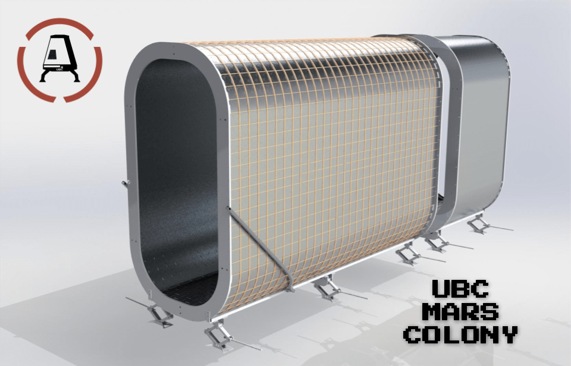

# UBC Mars Colony Website

## Special Documentation for you

Some things you need to know:

- Domain is bought at GoDaddy using the mars colony email and it will expires on 2025-03-26
- Website is hosted using Netlify, if you need access email me (inzaghi.moniaga@gmail.com)
- The website is based on the main branch and auto published, so before make any changes please start a new branch then merge after successful series of tests.
- This repository is private, let me know if you need access (inzaghi.moniaga@gmail.com)

## Table of Contents

- [File Information](#File)
- [Test Procedure](#Tests)
- [Procedure to add Sponsorship](#Sponsor)
- [Procedure to add a new Project](#Project)
- [Credits](#credits)

## File

- This is the `README.md` file
- The main page is located at `index.html` the reason is by default when opening a page it locates either index.html or main.html
- Assets that every page use is located at *\assets\css*, some additional photos are on the *LatestProject* and *PastProject* folder
- Sitemap is at the `sitemap.xml` which is used for the search engine Console
- Every project is under the `.html` format i.e. `farming.html`, `sabatier.html` and `helios.html`
- Sponsorship Guide can be edited on [canva](https://www.canva.com/design/DAE9bTPxnRs/bJoOaCdTSbuMORYpQv7heg/edit?utm_content=DAE9bTPxnRs&utm_campaign=designshare&utm_medium=link2&utm_source=sharebutton) and the file is named `SponsorshipGuide22.pdf`

## Tests

To View Different Devices Display
- Step 1 Right click and inspect element
- Step 2 **CTRL+SHIFT+M** to view different screen size

## Sponsor

1. Start by copying the code below

    ```
    <div class="swiper-slide"></div>
    ```
2. Look for the Client Section at `index.html` and below the other *swiper-slide* class, create a new line then paste the code above
3. Don't forget to replace the *[Location of Sponsor Image with File Type]* to the respective file location of the image
4. Go on [canva](https://www.canva.com/design/DAE9bTPxnRs/bJoOaCdTSbuMORYpQv7heg/edit?utm_content=DAE9bTPxnRs&utm_campaign=designshare&utm_medium=link2&utm_source=sharebutton) and Add a new sponsor on the last page
5. Once done, On canvas click share Save as pdf, then replace the old file of the sponsorship to the main website folder.
6. Don't forget to push the changes at the main branch

## Project

1. Start by copying one of the *.html* project page and rename it
2. Replace all the image and description is very straightforward on the editor
3. Don't forget back in the `index.html` locate the "Portofolio Section"
4. Copy, edit and paste the code below

    ```
<div class="col-xs-12 col-sm-6 col-md-6 col-lg-3" data-aos="flip-right" data-aos-delay="300">
                          <a href="https://www.ubcmarscompetition.com/">
                              <div class="card-flyer">
                                  <div class="text-box">
                                      <div class="image-box">
                                          
                                      </div>
                                      <div class="text-container">
                                          <h6>Airlock Inauguration</h6>
                                         <p>Our first highlight project was to design, prototype, and manufacture a functional and collapsible airlock.</p>
                                      </div>
                                  </div>
                              </div>
                          </a>
                      </div>
     ```
## Credits

[Inzaghi](https://github.com/InMDev)
[Patrick](https://github.com/typer234)
